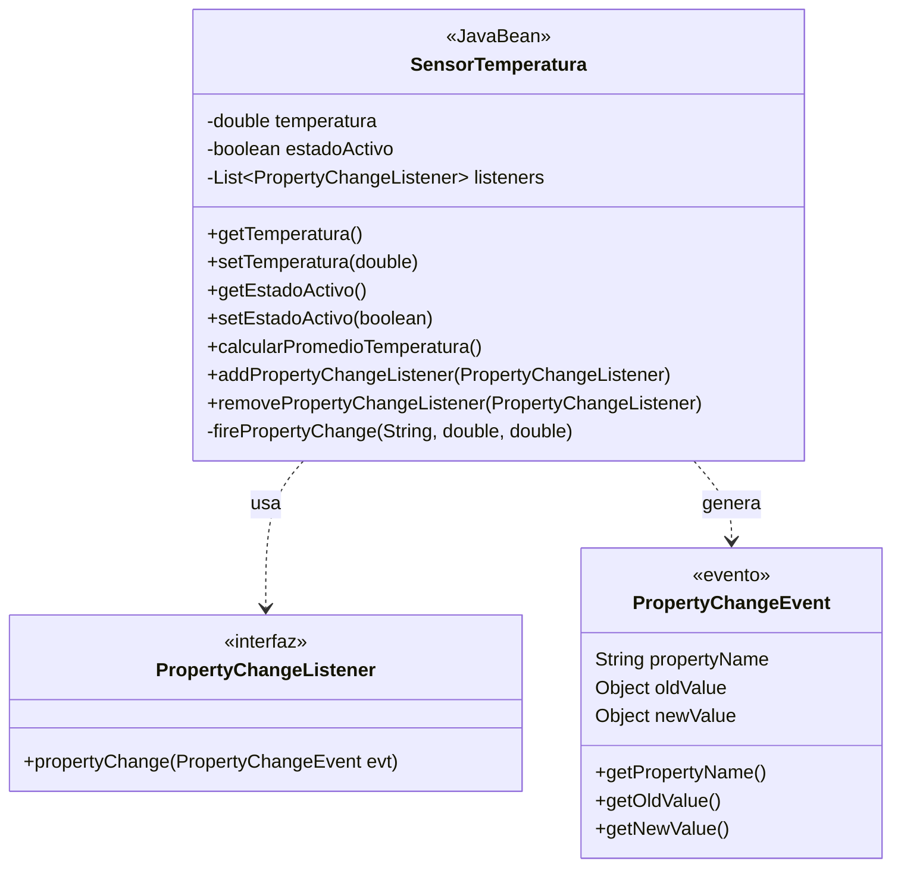

# Programación Orientada a Componentes y JavaBeans

## 1. Concepto de Componente Software

Un componente software es un elemento modular y autónomo que puede integrarse fácilmente en sistemas más grandes 1:1. Está diseñado como un bloque de construcción fundamental que facilita la creación de aplicaciones complejas mediante la combinación de elementos reutilizables.

## 2. Ventajas e Inconvenientes

| Ventajas | Inconvenientes |
| --- | --- |
| Reutilización de código | Mayor complejidad inicial |
| Facilidad de mantenimiento | Necesidad de documentación detallada |
| Integración flexible | Posible sobrecarga en sistemas pequeños |
| Desarrollo paralelo | Requiere planificación cuidadosa |
| Pruebas más simples | Curva de aprendizaje inicial |

## 3. Herramientas para Desarrollo de Componentes

- Frameworks de componentes (JavaBeans, Spring)
- IDEs especializados (NetBeans, Eclipse)
- Herramientas de empaquetado (Maven, Gradle)
- Entornos de desarrollo integrados

## 4. JavaBean: Concepto y Requisitos

Un JavaBean es un componente software que sigue ciertas convenciones específicas 0:2:

- Implementación de la interfaz Serializable
- Constructor público sin argumentos
- Propiedades privadas con getters y setters públicos
- Encapsulación adecuada de datos

## 5. Componente JavaBean: SensorTemperatura

Para cumplir con los requisitos del ejercicio, desarrollaremos un componente JavaBean que simula un sensor de temperatura. Este componente será funcional y educativo, permitiendo entender todos los conceptos clave de los JavaBeans.

Primero, veamos la estructura del componente:



## Explicación del Diagrama

El diagrama muestra la estructura completa de nuestro componente JavaBean SensorTemperatura:

- Las flechas punteadas (..>) indican dependencias: SensorTemperatura usa PropertyChangeListener y genera eventos PropertyChangeEvent
- PropertyChangeListener es una interfaz que define el contrato para los oyentes de eventos
- PropertyChangeEvent es una clase que encapsula la información del evento cuando cambian las propiedades
- SensorTemperatura implementa todas las características requeridas de un JavaBean, incluyendo propiedades privadas y métodos públicos

## Implementación del Componente

```java
import java.io.Serializable;
import java.util.ArrayList;
import java.util.List;

public class SensorTemperatura implements Serializable {
    private static final long serialVersionUID = 1L;
    
    // Propiedades privadas
    private double temperatura;
    private boolean estadoActivo;
    
    // Lista de listeners para eventos
    private List<PropertyChangeListener> listeners = new ArrayList<>();
    
    // Constructor sin argumentos
    public SensorTemperatura() {
        this.temperatura = 0.0;
        this.estadoActivo = false;
    }
    
    // Getters y setters
    public double getTemperatura() {
        return temperatura;
    }
    
    public void setTemperatura(double temperatura) {
        double oldValue = this.temperatura;
        this.temperatura = temperatura;
        firePropertyChange("temperatura", oldValue, temperatura);
    }
    
    public boolean getEstadoActivo() {
        return estadoActivo;
    }
    
    public void setEstadoActivo(boolean estadoActivo) {
        boolean oldValue = this.estadoActivo;
        this.estadoActivo = estadoActivo;
        firePropertyChange("estadoActivo", oldValue, estadoActivo);
    }
    
    // Método de comportamiento
    public double calcularPromedioTemperatura(int numMuestras) {
        if (!estadoActivo) {
            throw new IllegalStateException("El sensor debe estar activo");
        }
        // Simulación del cálculo promedio
        return temperatura * numMuestras / numMuestras;
    }
    
    // Gestión de eventos
    public void addPropertyChangeListener(PropertyChangeListener listener) {
        listeners.add(listener);
    }
    
    public void removePropertyChangeListener(PropertyChangeListener listener) {
        listeners.remove(listener);
    }
    
    private void firePropertyChange(String propertyName, double oldValue, double newValue) {
        PropertyChangeEvent evt = new PropertyChangeEvent(this, propertyName, oldValue, newValue);
        for (PropertyChangeListener listener : listeners) {
            listener.propertyChange(evt);
        }
    }
}
```

## Aplicación de Prueba

```java
public class SensorTemperaturaTest {
    public static void main(String[] args) {
        SensorTemperatura sensor = new SensorTemperatura();
        
        // Agregar listener para eventos
        sensor.addPropertyChangeListener((evt) -> {
            System.out.println("Cambio detectado:");
            System.out.println("Propiedad: " + evt.getPropertyName());
            System.out.println("Valor anterior: " + evt.getOldValue());
            System.out.println("Nuevo valor: " + evt.getNewValue());
        });
        
        // Pruebas básicas
        sensor.setEstadoActivo(true);
        sensor.setTemperatura(25.5);
        System.out.println("Temperatura actual: " + sensor.getTemperatura());
        System.out.println("Promedio de temperatura: " + 
                          sensor.calcularPromedioTemperatura(5));
    }
}
```

## Empaquetado del Componente

Crear archivo MANIFEST.MF en src/main/resources/META-INF:```properties
Manifest-Version: 1.0
Created-By: 1.8 (Oracle Corporation)
Name: com/ejemplos/sensortemperatura/
Specification-Title: SensorTemperatura JavaBean
Specification-Version: 1.0
Implementation-Version: 1.0
```

Compilar y empaquetar usando Maven o manualmente:```bash
jar cvfm sensor-temperatura.jar META-INF/MANIFEST.MF com/ejemplos/sensortemperatura/*.class
```

## Documentación Técnica

El componente implementa todas las características requeridas de un JavaBean:

- Implementación de Serializable para persistencia
- Constructor sin argumentos para fácil instanciación
- Propiedades privadas con getters y setters públicos
- Método de comportamiento para cálculos
- Sistema completo de eventos para notificaciones

## Instrucciones de Uso

Agregar el archivo sensor-temperatura.jar al proyectoImportar la clase SensorTemperaturaCrear una instancia del sensorRegistrar listeners para eventos si se desea recibir notificacionesUtilizar los métodos proporcionados según necesidadEste componente puede ser utilizado como base para otros sensores o componentes similares, demostrando los principios fundamentales de la programación orientada a componentes en Java.
